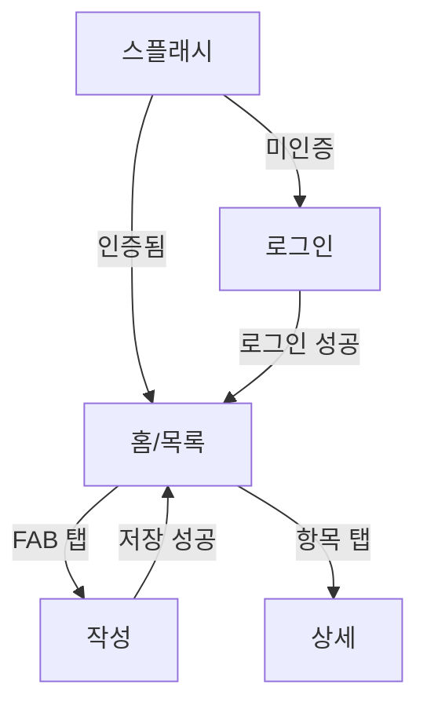

# 나의 서신서 (PrayStory) — 기능 명세서

> `docs/SPEC.md`로 저장. QA 0단계에서 클로드가 코드를 읽고 초안을 채우고, 성헌이 확정한다.
> **규칙: 코드가 이 문서와 다르면 이 문서가 옳고 코드가 결함이다.**
> 채울 수 없는 칸은 비워두고 `⚠️확인필요`로 표시. 추측으로 채우지 않는다.

| 항목 | 내용 |
|---|---|
| 버전 | v0.1 (초안) |
| 최종 수정 | YYYY-MM-DD |
| 대상 앱 버전 | versionName / versionCode |
| 확정자 | 성헌 |

---

## 0. ⚠️ 확인 필요 질문 목록

> 코드만 봐서는 의도를 알 수 없는 항목. 성헌이 답을 채우면 본문에 반영한다.

| # | 질문 | 관련 위치 | 답변 |
|---|---|---|---|
| Q1 | 기도문 본문 최대 길이 제한이 있는가? 초과 시 동작은? | | |
| Q2 | 저장 실패 시 임시저장을 유지하는가, 폐기하는가? | | |
| Q3 | 삭제는 soft delete인가 hard delete인가? 복구 가능 기간은? | | |
| Q4 | 오프라인 작성을 지원하는가? 지원한다면 재연결 시 동기화 규칙은? | | |
| Q5 | 두 기기에서 같은 기도문을 동시 수정하면 어느 쪽이 이기는가? | | |
| Q6 | 탈퇴 시 서버 데이터를 즉시 삭제하는가? 유예 기간은? | | |
| Q7 | 비로그인 상태로 사용 가능한 기능이 있는가? | | |
| Q8 | 알림은 어떤 조건에서 발송되며, 탭하면 어디로 가는가? | | |

---

## 1. 제품 개요

- **한 문장 정의:**
- **핵심 가치:**
- **주 사용자:**
- **핵심 사용 상황:** (언제, 어디서, 어떤 마음으로 여는 앱인가)
- **비목표(Non-goals):** 이 앱이 하지 않기로 한 것

---

## 2. 용어 정의

| 도메인 용어 | 의미 | 코드 식별자 | UI 표기(한) | UI 표기(영) |
|---|---|---|---|---|
| 기도문 | | `Prayer` | | |
| | | | | |

> 같은 개념이 코드·UI에서 다른 이름으로 불리면 여기서 통일한다.

---

## 3. 사용자 역할과 권한

| 역할 | 정의 | 접근 가능 화면 | 불가 |
|---|---|---|---|
| 비로그인 | | | |
| 로그인 사용자 | | | |

---

## 4. 정보 구조 (화면 목록)

| 화면ID | 이름 | 목적 | 진입 경로 | 이탈 경로 | 인증 필요 |
|---|---|---|---|---|---|
| SCR-01 | 스플래시 | | 앱 실행 | 온보딩 or 홈 | N |
| SCR-02 | 온보딩 | | | | N |
| SCR-03 | 로그인 | | | | N |
| SCR-04 | 회원가입 | | | | N |
| SCR-05 | 홈/목록 | | | | Y |
| SCR-06 | 기도문 작성 | | | | Y |
| SCR-07 | 기도문 상세 | | | | Y |
| SCR-08 | 기도문 수정 | | | | Y |
| SCR-09 | 검색 | | | | Y |
| SCR-10 | 설정 | | | | Y |
| SCR-11 | 알림 설정 | | | | Y |
| SCR-12 | 계정/탈퇴 | | | | Y |

### 4-1. 화면 전이도

---

## 5. 화면별 상세 명세

> 화면마다 아래 블록을 반복. 근거로 `파일:라인`을 단다.

### [SCR-06] 기도문 작성

- **목적:**
- **진입 경로:** (복수면 전부 나열 — 진입 경로마다 뒤로가기 목적지가 다르면 명시)
- **이탈 경로:** 저장 성공 → / 취소 → / 시스템 뒤로가기 →
- **사전조건:** 로그인 상태

**구성 요소**

| 요소 | 타입 | 초기값 | 유효성 규칙 | 비활성 조건 |
|---|---|---|---|---|
| 제목 입력 | TextField | 빈 값 | 최대 ?자 | - |
| 본문 입력 | TextField(multiline) | 빈 값 | 최소 1자, 최대 ?자 | - |
| 저장 버튼 | FilledButton | - | - | 본문 비었을 때 / 저장 중 |
| 취소/뒤로 | IconButton | - | - | 저장 중 |

**액션**

| 액션 | 트리거 | 성공 시 | 실패 시 | 사용자 피드백 |
|---|---|---|---|---|
| 저장 | 저장 버튼 | DB insert → 목록 최상단 반영 → 이전 화면 | 스낵바 + 입력 내용 유지 | 저장 중 로딩, 완료 토스트 |
| 이탈 | 뒤로가기 | 입력 없으면 즉시 나감 | 입력 있으면 확인 다이얼로그 | |

**상태별 화면**

| 상태 | 표시 내용 |
|---|---|
| Loading | |
| Empty | |
| Error | 문구 + 재시도 버튼 |
| Success | |

**발생 가능 에러와 처리**

| 상황 | 사용자 문구 | 복구 행동 |
|---|---|---|
| 네트워크 없음 | | |
| 세션 만료 | | |
| 서버 오류 | | |

- **근거:** `lib/.../write_screen.dart:__`

---

## 6. 기능 요구사항 (FR)

> 수용 기준은 Given/When/Then. 여기 없는 동작은 구현돼 있어도 "명세 공백"이다.

| FR-ID | 요구사항 | 우선순위 | 화면 | 수용 기준 |
|---|---|---|---|---|
| FR-001 | 사용자는 기도문을 작성해 저장할 수 있다 | P0 | SCR-06 | Given 로그인 상태 / When 본문 입력 후 저장 / Then 목록 최상단에 즉시 반영되고 앱 재시작 후에도 유지 |
| FR-002 | 사용자는 자신의 기도문만 조회할 수 있다 | P0 | SCR-05 | Given A로 로그인 / When 목록 조회 / Then B의 기도문은 어떤 경로로도 노출되지 않음 |
| FR-003 | 사용자는 기도문을 수정할 수 있다 | P0 | SCR-08 | |
| FR-004 | 사용자는 기도문을 삭제할 수 있다 | P0 | SCR-07 | Given 삭제 탭 / When 확인 다이얼로그 승인 / Then 목록에서 제거되고 되돌리기 안내 노출 |
| FR-005 | 작성 중 이탈 시 데이터가 유실되지 않는다 | P0 | SCR-06 | |
| FR-006 | 세션 만료 시 재인증 후 원래 작업으로 복귀한다 | P1 | 전역 | |
| FR-007 | 로그아웃 시 이전 사용자 데이터가 로컬에 남지 않는다 | P0 | 전역 | |
| FR-008 | 탈퇴 시 서버 데이터가 삭제된다 | P0 | SCR-12 | |
| FR-009 | 사용자는 기도문을 검색할 수 있다 | P1 | SCR-09 | |
| FR-010 | 다크모드가 시스템 설정을 따르거나 수동 선택된다 | P2 | SCR-10 | |
| FR-011 | 알림을 설정한 시각에 수신하고, 탭하면 지정 화면으로 이동한다 | P1 | SCR-11 | |
| FR-012 | 오프라인에서의 동작이 정의된 대로 수행된다 | P1 | 전역 | ⚠️Q4 확정 후 작성 |

---

## 7. 데이터 모델

| 테이블 | 컬럼 | 타입 | 필수 | 소유자 | 삭제 정책 |
|---|---|---|---|---|---|
| prayers | id / user_id / title / body / created_at / updated_at / deleted_at | | | user_id | soft / hard |
| profiles | | | | | |

### 7-1. 접근 권한 매트릭스 (RLS 기대 동작)

| 테이블 | 연산 | 본인 자원 | 타인 자원 | 비로그인(anon) |
|---|---|---|---|---|
| prayers | select | 허용 | **차단** | **차단** |
| prayers | insert | 허용(user_id=self 강제) | **차단** | **차단** |
| prayers | update | 허용 | **차단** | **차단** |
| prayers | delete | 허용 | **차단** | **차단** |
| storage:* | read/write | 허용 | **차단** | **차단** |

> 이 표는 QA 7단계에서 **실제 요청을 보내 실증**한다. 정책 파일 존재 확인만으로는 통과 아님.

---

## 8. 상태 전이 규칙

### 8-1. 인증 상태

| 현재 | 이벤트 | 다음 | 화면 동작 |
|---|---|---|---|
| 미인증 | 로그인 성공 | 인증 | 홈 이동 |
| 인증 | 토큰 만료 | 만료 | 자동 갱신 시도 |
| 만료 | 갱신 성공 | 인증 | 작업 계속 |
| 만료 | 갱신 실패 | 미인증 | 로그인 화면 + 복귀 지점 저장 |
| 인증 | 로그아웃 | 미인증 | 로컬 데이터 삭제 후 로그인 |

### 8-2. 기도문 문서 상태

| 현재 | 이벤트 | 다음 |
|---|---|---|
| 신규 | 입력 시작 | 작성중 |
| 작성중 | 저장 성공 | 저장됨 |
| 작성중 | 저장 실패 | 작성중(에러 표시, 입력 유지) |
| 작성중 | 이탈 | 임시저장 or 폐기 (⚠️Q2) |
| 저장됨 | 수정 시작 | 수정중 |
| 저장됨 | 삭제 | 삭제됨 |
| 삭제됨 | 수정 시도 | **불법 전이 — 도달 불가해야 함** |

> **앱 강제 종료 후 재시작 시 각 상태에서 어느 상태로 복원되는가:**

---

## 9. 비기능 요구사항

| 구분 | 요구사항 | 측정 방법 |
|---|---|---|
| 성능 | 콜드스타트 ≤ ?초, 목록 스크롤 60fps 유지 | |
| 성능 | 기도문 200건에서 목록·검색 응답 ≤ ?ms | |
| 보안 | 로그에 토큰·이메일·기도문 본문 미출력 | |
| 보안 | RLS로 타 사용자 데이터 접근 완전 차단 | 7-1 실증 |
| 접근성 | 터치 타깃 ≥48dp, 대비비 ≥4.5:1, 폰트 200%에서 오버플로 없음 | |
| 호환성 | minSdk __ 이상, 360x640~태블릿 대응 | |
| 개인정보 | 수집 항목 = 데이터 세이프티 = 처리방침 3자 일치 | |
| 언어 | 한국어/영어 리소스 누락 0건 | |

---

## 10. 에러 카탈로그

> 사용자에게 `Exception`, `null`, HTTP 코드가 그대로 노출되면 결함이다.

| 코드 | 상황 | 사용자 문구(한) | 사용자 문구(영) | 복구 행동 | 재시도 |
|---|---|---|---|---|---|
| E-NET-01 | 네트워크 없음 | | | | O |
| E-NET-02 | 타임아웃 | | | | O |
| E-AUTH-01 | 잘못된 로그인 정보 | | | | O |
| E-AUTH-02 | 세션 만료 | | | 재로그인 후 복귀 | O |
| E-VAL-01 | 본문이 비어 있음 | | | 저장 버튼 비활성 | - |
| E-VAL-02 | 최대 길이 초과 | | | | - |
| E-SRV-01 | 서버 오류(5xx) | | | | O |
| E-RATE-01 | 요청 과다(429) | | | | O |

---

## 11. 추적성 매트릭스

| FR-ID | 화면 | 케이스 ID | 자동화 층 | 실행 결과 | 관련 결함 |
|---|---|---|---|---|---|
| FR-001 | SCR-06 | TC-001~005 | L3/L5 | | |
| FR-002 | SCR-05 | TC-SEC-001 | L6 | | |

> **케이스가 0개인 FR이 하나라도 남아 있으면 테스트는 완료되지 않은 것이다.**

---

## 12. 변경 이력

| 날짜 | 버전 | 변경 내용 | 사유 |
|---|---|---|---|
| | v0.1 | 초안 (코드 역설계) | |
