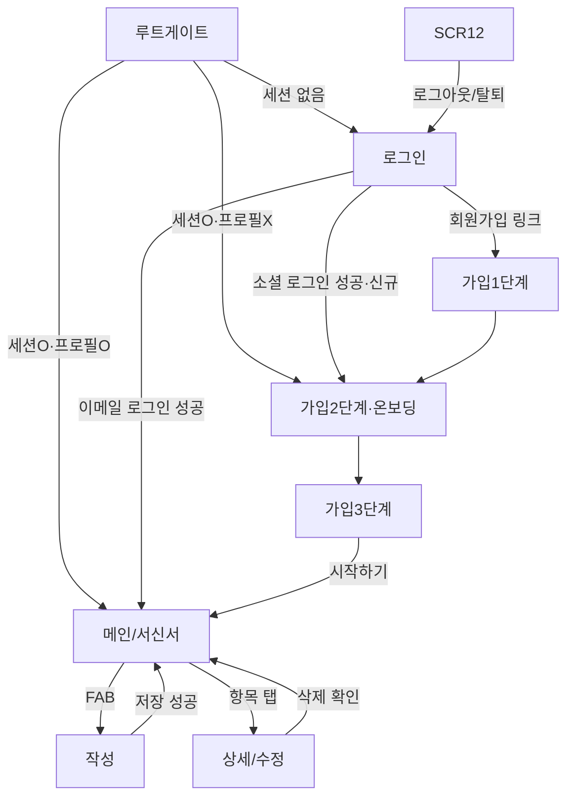

# 나의 서신서 (PrayStory) — 기능 명세서

> QA 0단계 산출물. **클로드가 코드를 역설계해 채운 초안이며, 확정 권한은 성헌에게 있다.**
> **규칙: 코드가 이 문서와 다르면 이 문서가 옳고 코드가 결함이다.**
> 확정 전까지 이 문서는 "코드가 이렇게 동작한다"는 관찰 기록이지 "이렇게 동작해야 한다"는 기준이 아니다.

| 항목 | 내용 |
|---|---|
| 버전 | v0.1 (초안, 코드 역설계) |
| 최종 수정 | 2026-07-24 |
| 대상 앱 버전 | versionName `1.0.0` / versionCode `1` (`pubspec.yaml:` version: 1.0.0+1) |
| 확정자 | 성헌 (미확정) |

---

## 0. ⚠️ 확인 필요 질문 목록 (성헌이 답하면 본문에 반영)

| # | 질문 | 관련 위치 | 판정 유형 | 답변 |
|---|---|---|---|---|
| Q1 | 기도문 **본문/제목 최대 길이 제한**이 있어야 하는가? | `prayer_write_screen.dart:263-308` | SPEC-GAP | ✅ **확정: 무제한 허용.** maxLength 두지 않음. (초장문 성능은 별도 모니터링) |
| Q2 | 작성 중 이탈 시 **임시저장(draft)** 도입 여부. | `prayer_write_screen.dart:131-138,206-209` | 확인 | ✅ **확정: 도입.** 단일 draft 자동저장(SharedPreferences) 방식. 클로드 권고안 채택 → FR-005 충족. |
| Q3 | 기도문 삭제 정책(hard vs soft). | `prayer_write_screen.dart:149,154-159` | SPEC-GAP | ✅ **확정: 하드 삭제 + Undo 스낵바.** 삭제 직후 몇 초간 "되돌리기" 탭 시 재insert. 향후 필요 시 휴지통으로 확장. |
| Q4 | **오프라인** 동작. | `prayer_provider.dart:19-25` | SPEC-GAP | ✅ **확정: 읽기 전용 캐시("불러온 건 전부 캐시").** 오프라인이면 캐시 표시 + 배지. 쓰기는 네트워크 필요. 전체 오프라인 동기화는 출시 후. |
| Q5 | 동시 수정 충돌 처리. | `prayer_write_screen.dart:93-97` | 확인 | ✅ **확정: last-write-wins 유지.** 개인앱·저확률로 수용된 리스크로 문서화. |
| Q6 | 탈퇴 시 서버 데이터 삭제 정책. | `account_screen.dart:45` | 확인 | ✅ **확정: 즉시 완전삭제.** 유예기간 없음. |
| Q7 | 비로그인 사용 가능 기능. | `main.dart:112` | 확인 | ✅ **확정: 없음. 전 기능 로그인 필수.** |
| Q8 | 알림 탭 동작. | `notification_service.dart:25` | SPEC-GAP | ✅ **확정: 앱만 열리면 됨.** 특정 화면 딥링크 불필요(현 동작 유지, 콜드스타트 시 열리는지만 검증). |
| Q9 | 기기 로컬 설정(알람/폰트/테마/언어) 계정무관 잔존. | `notification_provider.dart:9,84` | 확인 | ✅ **확정: 지금처럼(기기 로컬 유지).** ※ '내일의 기도 알림'(기도 내용 노출)은 현재 UI 미연결=고아 기능이라 유출 위험 도달 불가. 향후 연결 시 재검토. |
| Q10 | 커뮤니티 QA 범위. | `community_screen.dart` 외 | 범위 | ✅ **확정: 아래 "QA 범위 확정표" 채택.** 커뮤니티는 **보안(RLS)만 P0 필수**, 기능 동작은 P2. |

### QA 범위 확정표 (Q10, 2026-07-24 확정)

| 영역 | 범위 | 이유 |
|---|---|---|
| 인증(이메일/카카오/구글/온보딩) | **P0 필수** | 로그인 불가 = S1 |
| 기도문 CRUD + 검색 + 기록(달력/통계) | **P0 필수** | 앱 핵심 |
| 계정(로그아웃/완전탈퇴) | **P0 필수** | 데이터 삭제 = S1 |
| prayers/profiles RLS 크로스계정 보안 | **P0 필수** | 타인 기도문 노출 = S1 |
| 알림(매일 알람 기본 동작) | P1 필수 | |
| 설정(테마/언어/폰트) | P1 필수 | |
| 오프라인/에러 처리(Q4·Q2 반영 후) | P1 필수 | |
| 커뮤니티 — RLS 보안 | **P0 필수** | 다중 사용자 = 최대 유출 위험 |
| 커뮤니티 — 기능 동작(생성/참여/삭제) | P2 선택 | 부가기능 |

---

## 1. 제품 개요

- **한 문장 정의:** 매일의 기도를 "서신(편지)" 형태로 기록·보관하고, 지난 기록을 달력·통계로 돌아보며, 원하면 교회 공동체와 나눌 수 있는 기도 저널링 앱. (근거: `main.dart:79` title 'PrayStory', 홈 탭 라벨 'PrayStory', 하단탭 '기도 기록'/'커뮤니티' `main.dart:227,249`)
- **핵심 가치:** 기도문 = 민감 개인 기록. 유실·유출 없이 안전하게 축적하고, 지난 기도의 응답 여부를 추적한다. (근거: `prayer_model.dart:10` `isAnswered`, `prayer_provider.dart:140` answeredCount)
- **주 사용자:** 한국어/영어 사용 기독교인. 기기 언어가 한국어가 아니면 자동으로 영어 UI. (근거: `settings_provider.dart:60-64` `_detectDeviceLanguage`)
- **핵심 사용 상황:** ⚠️확인필요 (코드로 단정 불가 — 하루 마무리/새벽기도 등 의도는 성헌 확인)
- **비목표(Non-goals):** ⚠️확인필요 (예: 오프라인 지원 Q4, 알림 딥링크 Q8이 비목표인지 미구현인지 성헌 확인)

---

## 2. 용어 정의

| 도메인 용어 | 의미 | 코드 식별자 | UI 표기(한) | UI 표기(영) |
|---|---|---|---|---|
| 기도문 | 개인 기도 기록 1건(제목+본문) | `PrayerModel` (`prayer_model.dart:1`), 테이블 `prayers` | (서신/기록) | Letter / Prayer |
| 응답됨 | 기도가 응답되었다고 표시된 상태 | `answeredAt != null` (`prayer_model.dart:10`) | 응답 | Answered |
| 연속 기록 | 오늘부터 거꾸로 끊기지 않고 기록된 일수 | `streakCount` (`prayer_provider.dart:124-135`) | 연속 기록 | Streak |
| 모임(그룹) | 초대코드로 참여하는 기도 공동체 | `CommunityGroup` (`community_models.dart:1`), 테이블 `community_groups` | 모임 | Group |
| 서신(공개편지) | 커뮤니티에 올리는 편지 | `CommunityLetter` (`community_models.dart:125`), 테이블 `community_letters` | 서신 | Letter |
| 중보(함께 기도) | 남의 서신에 "함께 기도" 표시 | `LetterPrayerInfo` (`community_models.dart:71`) | 함께 기도 | Pray Together |
| 내일의 기도 알림 | 특정 날짜/시각 1회성 알림 | `TomorrowPrayerAlarm` (`notification_provider.dart:83`) | ⚠️확인 | ⚠️확인 |

> ⚠️확인필요: "기도문"이 UI에서 '서신'과 '기록'으로 혼용된다. 통일 표기를 성헌이 확정.

---

## 3. 사용자 역할과 권한

| 역할 | 정의 | 접근 가능 화면 | 불가 |
|---|---|---|---|
| 비로그인 | 세션 없음 | 로그인, 회원가입(1~3단계) | 그 외 전부 (`main.dart:112` 세션 null → LoginScreen 고정) |
| 로그인(프로필 없음) | 세션 O, `profiles` 행 없음 (소셜 첫 로그인) | 회원가입 2단계로 강제 이동(온보딩) | 메인 진입 (`main.dart:119-120`) |
| 로그인(프로필 있음) | 세션 O + 프로필 O | 메인 전체(서신서/기록/커뮤니티/설정) | 타인 데이터 (RLS, 7장) |

---

## 4. 정보 구조 (화면 목록)

> 이 앱은 `Navigator` 라우트명이 아니라 **탭 인덱스 + `MaterialPageRoute` push** 혼합 구조다. SCR-ID는 QA용 논리 식별자.

| 화면ID | 이름 | 목적 | 진입 경로 | 이탈 경로 | 인증 |
|---|---|---|---|---|---|
| SCR-01 | 스플래시/루트게이트 | 세션·프로필 판정 후 분기 | 앱 실행 | 로그인 or 온보딩 or 메인 | N |
| SCR-03 | 로그인 | 이메일/카카오/구글 로그인 | 루트게이트(세션X), 로그아웃/탈퇴 후 | 메인 or 회원가입1 | N |
| SCR-04a | 회원가입 1단계 | 이메일/비번 입력 | 로그인 "회원가입" | 2단계 | N |
| SCR-04b | 회원가입 2단계 | 프로필(이름/교회/성별/연령대) | 가입1단계, **소셜 첫 로그인 온보딩** | 3단계 | N/부분 |
| SCR-04c | 회원가입 3단계 | 테마 선택 + 최종 가입 커밋 | 가입2단계 | 메인 | 부분 |
| SCR-05 | 홈/서신서 | 날짜별 기도문 열람(양면 책 뷰) | 하단탭 0 | 탭 이동, FAB→작성 | Y |
| SCR-06 | 기도문 작성 | 새 기도문 작성 | FAB(`main.dart:233`), 홈 빈 페이지 탭 | 저장/취소 → 닫힘 | Y |
| SCR-07 | 기도문 상세/수정 | 기존 기도문 열람·수정·삭제 | 홈/기록에서 항목 탭 | 저장/삭제/닫기 | Y |
| SCR-08 | (수정은 SCR-07과 동일 위젯) | `PrayerWriteScreen(prayer:)` | — | — | Y |
| SCR-09 | 검색 | 제목/본문 검색 | 홈 검색 오버레이 | 닫기 | Y |
| SCR-Rec | 기도 기록 | 달력+통계+최근기록 | 하단탭 1 | 탭 이동 | Y |
| SCR-Com | 커뮤니티 | 모임/서신 | 하단탭 2 | 탭 이동, 모임 상세 push | Y |
| SCR-10 | 설정 | 설정 허브 | 하단탭 3 | 항목 push | Y |
| SCR-11 | 알림 설정 | 기도 알람 관리 | 설정→앱설정→알림 | 뒤로 | Y |
| SCR-12 | 계정/탈퇴 | 로그아웃/회원탈퇴 | 설정→계정 | 로그아웃·탈퇴 후 로그인 | Y |

### 4-1. 화면 전이도 (초안, 1단계에서 정밀화 예정)

---

## 5. 화면별 상세 명세

### [SCR-06/07] 기도문 작성·수정 (동일 위젯 `PrayerWriteScreen`)

- **목적:** 새 기도문 작성(`prayer==null`) 또는 기존 기도문 수정(`prayer!=null`). (근거: `prayer_write_screen.dart:54-57`)
- **진입 경로:**
  - 작성: 하단 FAB → `_openWriteSheet` 바텀시트, `targetDate=selectedDate` (`main.dart:145-159`)
  - 수정: 홈/기록에서 항목 탭 → `PrayerWriteScreen(prayer:)` ⚠️확인필요(정확한 호출부 미독)
- **이탈 경로:** 저장 성공 → `Navigator.pop` + 스낵바(`:118-130`) / 취소(X) → `Navigator.pop`(`:206-209`) / 삭제 성공 → pop + 스낵바(`:153-159`)
- **사전조건:** 로그인 상태 (`user==null`이면 저장 조용히 중단 `:90`)

**구성 요소**

| 요소 | 타입 | 초기값 | 유효성 규칙 | 비활성 조건 |
|---|---|---|---|---|
| 제목 입력 | TextField | 기존 title or '' (`:71`) | **길이제한 없음 ⚠️Q1** | - |
| 본문 입력 | TextField(multiline, expands) | 기존 content or '' (`:72`) | trim 후 1자 이상, **상한 없음 ⚠️Q1** (`:188`) | - |
| 저장 버튼 | TextButton | - | `_canSave` (`:187-194`) | 본문 빈값 / 저장중 / 수정인데 변경 없음 (`:228`) |
| 삭제 버튼 | TextButton | - | 수정 모드만 표시 (`:240`) | - |
| 폰트크기 | IconButton | - | - | - |
| 닫기(X) | IconButton | - | - | **저장중에도 활성 ⚠️** (`:206`, `_isSaving` 미반영) |

**액션**

| 액션 | 트리거 | 성공 시 | 실패 시 | 피드백 |
|---|---|---|---|---|
| 저장(신규) | 저장 버튼 | insert → `prayersForDateProvider`/`monthPrayersProvider` invalidate → pop → 스낵바 | `PostgrestException` → 스낵바 `errSaveFailed`, 시트 유지 | 완료 스낵바 (`:107-135`) |
| 저장(수정) | 저장 버튼 | update(title/content/updated_at) by id → invalidate → pop | 동일 | (`:92-97`) |
| 삭제 | 삭제 버튼 | 확인 다이얼로그 → **hard delete** → invalidate → pop → 스낵바 | `PostgrestException` → 스낵바 `errDeleteFailed` | (`:141-166`) |

**상태별 화면**

| 상태 | 표시 내용 |
|---|---|
| Loading(저장중) | 저장 버튼 비활성(`_isSaving`), **but 진행 인디케이터 없음 ⚠️** |
| Empty | 힌트 텍스트(`writeHintTitle`/`writeHintContent`) |
| Error | 스낵바만 (재시도 버튼 없음) |
| Success | pop + 스낵바 |

**발생 가능 에러와 처리**

| 상황 | 사용자 문구 | 복구 |
|---|---|---|
| 네트워크 없음 | ⚠️미처리 추정 — `PostgrestException`이 아닌 네트워크 예외는 catch 안 함 (`:131` on PostgrestException만) | 없음 |
| 세션 만료 | ⚠️미처리 추정 | 없음 |
| 서버 오류 | `errSaveFailed` (`:133`) | 입력 유지 |

- **근거:** `lib/screens/write/prayer_write_screen.dart:54-316`

> **⚠️ 잠재 결함 후보(2단계에서 결함 확정 여부 판정):** ① 저장 중 X버튼 활성 → 저장 진행 중 시트 닫기 가능(비동기 경합, `:206`). ② `on PostgrestException`만 잡아 네트워크(SocketException 등)는 uncaught → `finally`로 `_isSaving`은 풀리지만 스낵바 없음(`:131,136`).

---

## 6. 기능 요구사항 (FR)

> 아래 수용 기준 중 빈칸은 성헌 확정 대기. "코드 관찰"은 현재 코드가 그렇게 동작한다는 뜻이지 기준 확정이 아니다.

| FR-ID | 요구사항 | 우선순위 | 화면 | 수용 기준 / 코드 관찰 |
|---|---|---|---|---|
| FR-001 | 기도문을 작성해 저장할 수 있다 | P0 | SCR-06 | Given 로그인 / When 본문 입력 후 저장 / Then 해당 날짜 목록에 반영·재시작 후 유지. 코드관찰: insert 후 invalidate (`write:107-116`) |
| FR-002 | 자신의 기도문만 조회된다 | P0 | SCR-05 | 코드관찰: 모든 쿼리에 `.eq('user_id', user.id)` (`prayer_provider.dart:22,44,77`) + RLS(7장, 실증 필요) |
| FR-003 | 기도문을 수정할 수 있다 | P0 | SCR-07 | 코드관찰: update by id, 변경 없으면 저장 비활성 (`write:92-97,189-193`) |
| FR-004 | 기도문을 삭제할 수 있다 | P0 | SCR-07 | **확정: 하드 삭제 + 확인 다이얼로그 + Undo 스낵바.** Given 삭제 확인 / When 삭제 / Then 목록에서 제거 + "되돌리기" 스낵바 노출, 되돌리기 탭 시 재insert. **구현 완료(2026-07-24), 실기기 release 빌드 검증 PASS.** |
| FR-005 | 작성 중 이탈 시 데이터 유실 방지 | P0 | SCR-06 | **확정: 단일 draft 자동저장(SharedPreferences).** Given 본문 입력 후 이탈 / When 작성화면 재진입 / Then 이전 입력 복원 + "이어쓰기" 안내, 저장 성공 시 draft 삭제. **구현 완료(2026-07-24), 실기기 release 빌드 검증 PASS.** |
| FR-006 | 세션 만료 시 재인증 후 원작업 복귀 | P1 | 전역 | 코드관찰: 복귀지점 저장 **없음** — 세션 만료 시 LoginScreen (`main.dart:112`) ⚠️ |
| FR-007 | 로그아웃 시 이전 사용자 데이터 잔존 안 함 | P0 | 전역 | 코드관찰: 기도문은 서버 직결이라 로컬 미잔존. **단 알람/폰트/테마/언어는 SharedPreferences에 기기별 잔존** (`notification_provider.dart:9`) ⚠️Q9 |
| FR-008 | 탈퇴 시 서버 데이터 삭제 | P0 | SCR-12 | 코드관찰: Edge Function `delete-account` 즉시 호출, hard delete (`account:45`) ⚠️Q6 |
| FR-009 | 기도문을 검색할 수 있다 | P1 | SCR-09 | 코드관찰: title/content `ilike`, 최대 20건 (`prayer_provider.dart:41-47`) |
| FR-010 | 다크모드 시스템/수동 선택 | P2 | SCR-10 | 코드관찰: system/light/dark, SharedPreferences 저장 (`settings_provider.dart:17-45`, `main.dart:71-77`) |
| FR-011 | 설정 시각에 알림 수신, 탭 시 앱이 열린다 | P1 | SCR-11 | **확정: 딥링크 불필요, 탭 시 앱만 열리면 됨.** 매일 반복 알람 스케줄 O (`notification_service.dart:54-81`). 검증: 콜드스타트에서 탭 시 앱 실행되는지만 확인. |
| FR-012 | 오프라인 시 마지막으로 불러온 기도문을 읽을 수 있다 | P1 | 전역 | **확정: 읽기 전용 캐시.** Given 온라인에서 조회한 기도문 / When 오프라인 전환 후 재조회 / Then 캐시된 내용 표시 + 오프라인 배지. 쓰기는 네트워크 필요. **구현 완료(2026-07-24, `prayer_provider.dart`).** ⚠️**알려진 제한(수용됨, 2026-07-24):** 이 캐시는 **"앱 사용 중(warm) 오프라인 전환"에서만 유효**하다. **완전 오프라인 상태에서 앱을 콜드스타트하면 인증/프로필 게이트가 네트워크에 의존해 로그인 화면으로 빠지고 캐시된 기도문에 접근할 수 없다** (`main.dart` `_RootGate`). "오프라인에서 앱을 열어 지난 기록을 읽는다"는 직관적 시나리오는 **미지원**. 게이트 개선은 출시 후 백로그로 보류, 현재는 배지 문구(`offlineCachedNotice`: "오프라인 상태예요 · 온라인 연결을 권장해요")로 사용자에게 온라인 연결을 안내하는 선에서 대응. |
| FR-013 | 언어 자동감지(기기 언어 기준) + 수동 우선 | P1 | 전역 | 코드관찰: `_detectDeviceLanguage` (`settings_provider.dart:60-88`) |
| FR-014 | 지난 기록을 달력·통계로 조회 | P1 | SCR-Rec | 코드관찰: 월간/주간, 연속기록/응답수 (`prayer_provider.dart:145-187`) |
| FR-015 | 커뮤니티 모임 생성·참여·서신·중보 | ⚠️Q10 | SCR-Com | 코드관찰: `community_provider.dart` (상세 미독) |

---

## 7. 데이터 모델

| 테이블 | 주요 컬럼 | 소유자 | 삭제 정책 | 근거 |
|---|---|---|---|---|
| prayers | id / user_id / title / content / created_at / updated_at / answered_at | user_id | **hard** (`.delete()`) | `prayer_model.dart:1-38`, `write:149` |
| profiles | id / name / birthdate / birth_year / gender / church (+ email은 auth) | id=user | ⚠️탈퇴 시 Edge Function 삭제 | `profile_model.dart:1-33`, `profile_provider.dart:10-17` |
| community_groups | id / name / description / icon / invite_code / owner_id / max_members / created_at | owner_id | ⚠️확인 | `community_models.dart:1-36` |
| group_members | id / group_id / user_id / role / joined_at | — | ⚠️확인 (RLS fix 기록 있음) | `community_models.dart:90-123` |
| community_letters | id / author_id / group_id? / recipient_name? / content / visibility / anonymous_name / anonymous_emoji / created_at | author_id | 본인 삭제 RLS | `community_models.dart:125-161` |
| group_notices | id / group_id / author_id / content / created_at | author_id | ⚠️확인 | `community_models.dart:38-69` |
| feedback | (피드백) | user | ⚠️확인 | `feedback_screen.dart` (미독) |

> **로컬 저장(SharedPreferences, 기기별·계정무관):** `app_theme_mode`, `app_language`, `prayer_font_size`, `prayer_alarms_v1`, `tomorrow_prayer_alarms_v1`. (근거: `settings_provider.dart:18,67`, `notification_provider.dart:8,84`)

### 7-1. 접근 권한 매트릭스 (RLS 기대 동작 — QA 7단계에서 실증)

| 테이블 | 연산 | 본인 | 타인 | anon |
|---|---|---|---|---|
| prayers | select/insert/update/delete | 허용 | **차단** | **차단** |
| profiles | select(본인) | 허용 | ⚠️확인(커뮤니티는 이름 join 필요) | **차단** |
| community_letters | delete | 허용(본인) | **차단** | **차단** |
| group_members | delete | 본인 탈퇴 + 방장이 멤버 내보내기 | **차단** | **차단** |

> 클라이언트는 insert 시 `user_id: user.id`를 직접 넣는다(`write:108`). 서버 RLS가 위조를 막아야 한다 — 7단계 실증 필수.

---

## 8. 상태 전이 규칙

### 8-1. 인증 상태 (코드 관찰)

| 현재 | 이벤트 | 다음 | 화면 동작 | 근거 |
|---|---|---|---|---|
| 미인증 | 이메일 로그인 성공 | 인증 | authState 스트림 갱신 → 메인 | `login_screen.dart:43-47` |
| 미인증 | 소셜 로그인 성공(신규) | 인증·프로필없음 | 온보딩(가입2단계) | `main.dart:119` |
| 인증 | 토큰 만료 | (supabase 자동 갱신) | ⚠️명시적 처리 없음 | — |
| 인증 | 로그아웃 | 미인증 | popUntil first → LoginScreen | `account_screen.dart:22-27` |
| 인증 | 탈퇴 | 미인증 | Edge Function → 로컬 signOut → popUntil | `account_screen.dart:45-53` |

### 8-2. 기도문 문서 상태 (코드 관찰)

| 현재 | 이벤트 | 다음 | 근거 |
|---|---|---|---|
| 신규 | 본문 입력 | 작성중 | `write:187` |
| 작성중 | 저장 성공 | 저장됨 | `write:107` |
| 작성중 | 저장 실패 | 작성중(스낵바, 입력 유지) | `write:131-138` |
| 작성중 | 이탈(X/취소) | **폐기(경고·draft 없음)** ⚠️Q2 | `write:206-209` |
| 저장됨 | 수정 저장 | 저장됨 | `write:92-97` |
| 저장됨 | 삭제 | 삭제됨(hard, 복구불가) | `write:149` |
| 삭제됨 | 수정 시도 | **불법 전이 — 도달 불가해야 함** ⚠️2단계 검증 | — |

> **강제종료 후 재시작 복원:** 작성중 상태는 서버·로컬 어디에도 저장 안 됨 → **입력 전부 유실**. (근거: draft 저장 코드 부재) ⚠️Q2

---

## 9. 비기능 요구사항 (측정 기준은 성헌 확정 대기)

| 구분 | 요구사항 | 코드 관찰 |
|---|---|---|
| 보안 | RLS로 타 사용자 데이터 완전 차단 | 7-1 실증 필요 |
| 보안 | 로그에 토큰·이메일·기도문 미출력 | ⚠️ 8단계에서 `print`/`debugPrint` 색출 |
| 언어 | 한/영 리소스 누락 0건 | gen-l10n 완료 기록(메모리), 8단계 재확인 |
| 개인정보 | 수집=데이터세이프티=처리방침 3자 일치 | 7-4에서 대조 |
| 성능 | 콜드스타트/스크롤 60fps | ⚠️ 측정 기준 미정 |
| 접근성 | 터치타깃 ≥48dp, 대비 ≥4.5:1 | ⚠️ 하단탭 FAB 48x48 확인(`main.dart:235-236`), 나머지 6단계 |

---

## 10. 에러 카탈로그 (코드에 존재하는 것만, 문구는 ARB 키로 표기)

| 코드 | 상황 | 사용자 문구 키 | 복구 | 근거 |
|---|---|---|---|---|
| E-AUTH-01 | 빈 자격증명 | `errEmptyCredentials` | 재입력 | `login_screen.dart:37` |
| E-AUTH-02 | 로그인 실패 | `errLoginFailed` | 재시도 | `login_screen.dart:48-49` |
| E-AUTH-03 | 구글 실패 | `errGoogleFailed` | 재시도 | `login_screen.dart:66,77,80` |
| E-AUTH-04 | 카카오 실패 | `errKakaoFailed` | 재시도 | `login_screen.dart:97-98` |
| E-SAVE-01 | 저장 실패(Postgrest) | `errSaveFailed` | 입력 유지 | `write:133` |
| E-DEL-01 | 삭제 실패(Postgrest) | `errDeleteFailed` | — | `write:162` |
| E-ACC-01 | 탈퇴 실패(Function) | `accountWithdrawFailed` | — | `account:57` |
| — | **네트워크 없음/타임아웃/429/5xx 구분 처리** | **없음 ⚠️** | — | catch가 특정 예외만 |

---

## 11. 추적성 매트릭스 (5단계 산출물에서 채움 — 현재 골격만)

| FR-ID | 화면 | 케이스 ID | 결과 |
|---|---|---|---|
| FR-001~015 | — | (미작성) | 4단계에서 도출 |

---

## 12. 변경 이력

| 날짜 | 버전 | 변경 | 사유 |
|---|---|---|---|
| 2026-07-24 | v0.1 | 초안(코드 역설계) | QA 0단계 |
| 2026-07-24 | v0.2 | Q1~Q10 성헌 확정 반영, QA 범위 확정표, 구현 백로그 추가 | 0단계 확정 |
| 2026-07-24 | v0.3 | 13장 백로그 B1/B2/B3 구현+실기기 release 검증 완료 반영, FR-012에 오프라인 콜드스타트 제한사항 명시 | 구현 세션 |

---

## 13. 구현 백로그 (2026-07-24 전부 구현 완료·실기기 release 빌드 검증 완료)

> B1 → B2 → B3 순서로 구현, 셋 다 `lib/services/local_prayer_store.dart`(SharedPreferences)를 공유.

### B1. 기도문 삭제 Undo 스낵바 (FR-004) — ✅ 완료
- `prayer_write_screen.dart`(공용 `showPrayerDeletedSnackBar`) + `home_screen.dart` 목록 삭제 경로 둘 다 적용.
- 삭제된 `PrayerModel`을 캡처 → "되돌리기" 스낵바 → 탭 시 `restorePrayer()`로 created_at/answered_at 보존 재insert.
- 실기기 검증: 삭제→Undo 스낵바→되돌리기→원래 시각("N분 전") 그대로 복원 PASS.
- ARB `undoDelete`/`errRestoreFailed` 추가(한/영).

### B2. 작성 중 draft 자동저장 (FR-005) — ✅ 완료
- `prayer_write_screen.dart`, 신규 작성 모드(`prayer==null`)만 적용.
- 본문/제목 onChanged → 800ms 디바운스 → `prayer_draft_v1` 저장. 같은 날짜(targetDate) 재진입 시에만 프리필 + "작성 중이던 내용을 불러왔어요" 스낵바. 저장 성공 시 draft 삭제.
- 실기기 검증: 작성 후 강제종료→재실행→FAB→제목·본문 복원 PASS.
- ARB `draftRestored` 추가(한/영).

### B3. 오프라인 읽기 전용 캐시 (FR-012) — ✅ 구현 완료, ⚠️범위 제한 확인됨
- `prayer_provider.dart`의 `prayersForDateProvider`/`monthPrayersProvider`: fetch 성공 시 캐시 저장, 네트워크 예외 시 캐시 폴백 + `isOfflineProvider` true(서버 오류 `PostgrestException`은 폴백 대상 아님). 홈에 오프라인 배지(`offlineCachedNotice`) 추가.
- 로그아웃/탈퇴 시 `LocalPrayerStore.clearAll()`로 draft+캐시 전부 삭제 확인(`account_screen.dart`) — 보안 요건 충족.
- **실기기에서 발견된 제한(FR-012 표에 반영, 수용됨):** 완전 오프라인 콜드스타트는 인증 게이트 때문에 로그인 화면으로 빠져 캐시에 도달 못 함 — warm 전환에서만 유효. 배지 문구를 "오프라인 상태예요 · 온라인 연결을 권장해요"로 온라인 재연결 권장 안내로 확정(2026-07-24).

### 관련 기존 잠재 결함 — ✅ 함께 처리 완료
- 저장 중 X(닫기) 버튼 비활성화 처리 완료 (`_isSaving`이면 pop 차단).
- `on PostgrestException`만 잡던 catch를 `catch(_)`로 확장 → 네트워크 예외도 스낵바 표시.

### 미해결로 남은 것 (출시 후 백로그 후보)
- 오프라인 콜드스타트 시 로그인 게이트에 막히는 구조적 제약(위 B3 참고) — 이번 스코프에선 배지 안내로 대응, 근본 해결(예: 세션 캐시 우선 진입)은 보류.
- 오프라인 배지가 실제로는 "재조회가 네트워크 예외로 실패하는" 좁은 조건에서만 뜬다 — 기기 connectivity 상태를 직접 구독하는 방식이 더 안정적일 수 있음(향후 검토).

### 미해결/보류
- 고아 기능: '내일의 기도 알림'(`addTomorrowAlarm`, `notification_provider.dart:118`) UI 미연결. 향후 연결 시 로그아웃 시 기도내용 알림 유출(Q9) 재검토.
